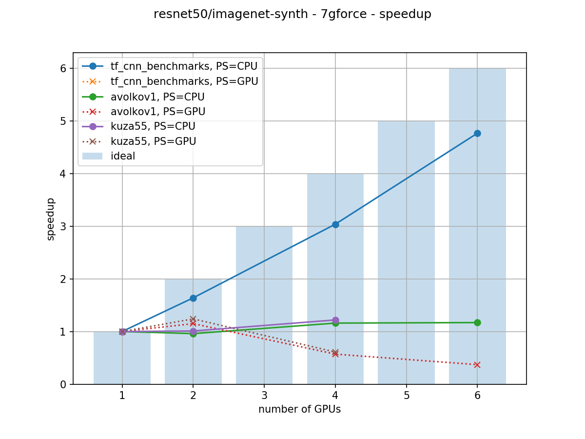
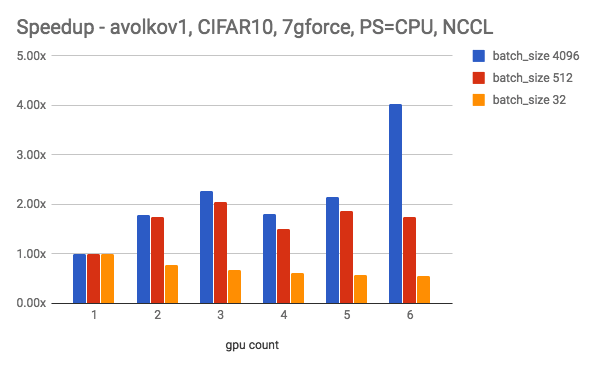

# Towards Efficient Multi-GPU Training in Keras with TensorFlow

_A summary blog post for publishing on Medium and additional resources on GitHub (Markdown documents)._

Bohumír Zámečník, [Rossum AI](https://rossum.ai/), 2017-10-19

At Rossum, we are training large neural network models daily on powerful GPU servers and making this process quick and efficient is becoming a priority for us.  We expected to easily speed up the process by simply transitioning the training to use multiple GPUs at once, a common practice in the research community.

But to our surprise, this problem is still far from solved in Keras, the most popular deep learning research platform which we also use heavily!  While multi-GPU data-parallel training is already possible in Keras with Tensorflow, it is far from efficient with large, real-world models and data samples.  Some alternatives exist, but no simple solution is yet available.  Read on to find out more about what's up with using multiple GPUs in Keras in the rest of this technical blogpost.

## Introduction

In this blog article there's just a quick summary and more details and code are provided in our [GitHub repository](https://github.com/rossumai/keras-multi-gpu/tree/master/blog/docs).

### Why?

At [Rossum](https://rossum.ai), we'd like to reduce training of our image-processing neural models from 1-2 days to the order of hours. We use [Keras](https://keras.io) on top of [TensorFlow](https://www.tensorflow.org). At hand we have custom-built machines with 7 GPUs (GTX 1070 and 1080) each and common cloud instances with 2-4 GPUs (eg. Tesla M60 on Azure). Can we utilize them to speed up the training?

It's not uncommon that bigger models take many hours to train. We already parallelize the computation by using many-core GPUs. The next step is using multiple GPUs, then possibly multiple machines. Although we introduce more complexity, we expect decrease in training time. Ideally the training should scale inversely and the throughput of data samples per second linearly with respect to the number of GPUs. Of course we also expect some overhead of operations that cannot be parallelized.

[TenslowFlow shows](https://www.tensorflow.org/performance/benchmarks) achieving almost linear speed-up in their benchmarks of high-performance implementations of non-trivial models on cloud up to 8 GPUs.

Can we do similarly in our custom models using Keras with TensorFlow? We already have a lot of models written in Keras and we chose these technologies for long term. Although rewriting to pure TensorFlow might be possible, we'd lose a lot of comfort of high-level API of Keras and its benefits like callbacks, sensible defaults, etc.

### Scope

We limit the scope of this effort to training on single machine with multiple commonly available GPUs (such as GTX 1070, Tesla M60), not distributed to multiple nodes, using data parallelism and we want the resulting implementation in Keras over TensorFlow.

### Organization of the Article

Since the whole topic is very technical and rather complex, the main story is outlined in this article and details have been split into several separate articles. First, we review existing algorithms a techniques, then existing implementations of multi-GPU training in common deep learning frameworks. We need to consider particular hardware since the performance heavily depends on it. To get intuition on what techniques are working well and how to perform and evaluate various measurements of existing implementations, we looked at what architectures and datasets are suitable for benchmarking. Then we finally review and measure existing approaches of multi-GPU training specifically in Keras + TensorFlow and look at their pros and cons. Finally we suggest which techniques might help.

In addition there's:

- [code repository](https://github.com/rossumai/keras-multi-gpu)
- [big spreadsheet with measurements ](https://docs.google.com/spreadsheets/d/1c5yGydEANMzHjBufTzph0w-WGwJyiwPMRYz3yBZatb4/edit#gid=0)

### Let's Dive In

- [Algorithms and techniques](algorithms-and-techniques.md)
- [Hardware](hardware.md)
- [Other implementations](other-implementations.md)
- [Implementations in Keras over TensorFlow](keras-tensorflow.md)
- [Measurements](measurements.md)
- [Conclusion and suggestions how to improve](conclusion.md)

### Short Conclusion

Currently, multi-GPU training is already possible in Keras. Besides various third-party scripts for making a data-parallel model, there's already [an implementation in the main repo](https://github.com/fchollet/keras/blob/3dd3e8331677e68e7dec6ed4a1cbf16b7ef19f7f/keras/utils/training_utils.py#L56-L75) (to be released in 2.0.9, its speed is similar to the tested _avolkov1_ and _kuza55_ scripts). In our experiments, this is able to provide _some_ speed-up - but on large tasks where small batch sizes are necessary, the speed-up is minimal (compared to TensorFlow benchmarks) or actually even negative!

Also, there are some recently released third-party packages like [horovod](https://github.com/uber/horovod) or [tensorpack](https://github.com/tensorpack) that support data-parallel training with TensorFlow and Keras. Both claim good speed-up (so far we weren't able to measure them), but the cost is a more complicated API and setup (e.g. a dependency on MPI).

From measuring TensorFlow benchmarks ([tf_cnn_benchmarks](https://github.com/tensorflow/benchmarks/tree/master/scripts/tf_cnn_benchmarks)), we can see that good speed-up with plain TensorFlow is possible, but rather complicated. They key ingredients seem to be asynchronous data feeding to from CPU to GPU using StagingArea and asynchronous feed of data to TensorFlow itself (either from Python memory using TF queues or from disk).

Ideally, we'd like to get a good speed-up with a simple Keras-style API and without relying on external libraries other than Keras and TensorFlow themselves. In particular, we need to correcly implement pipelining (at least double-buffering) of batches on the GPU using StagingArea, and if necessary also providing data to TF memory asynchronously (using TF queues or the Dataset API). We found the best way to benchmark improvements is the nvprof tool.

Along with this article, [we provided some code](https://github.com/rossumai/keras-multi-gpu) to help with making benchmarks of multi-GPU training with Keras.  At the moment, we are working further to [help Keras-level multi-GPU training speedups become a reality](https://github.com/avolkov1/keras_experiments/issues/2#issuecomment-339507791).
