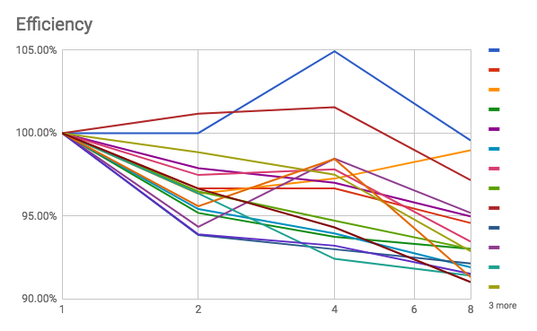
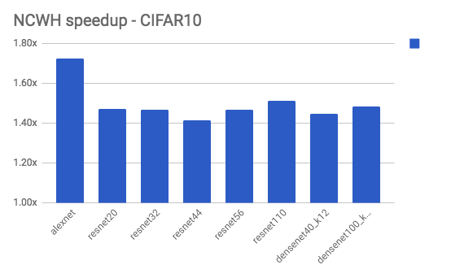
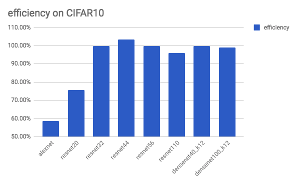

# Experiments and measurements

Let's try various approaches in practice, measure their performance and decide what techniques are suitable.

## Introduction

### Metrics

- What to measure?
    - **images/sec** (thoughput)
        - or in general data points / sec
        - used in TF benchmarks
        - independent of dataset size, batch size, etc.
        - either mean or median over batches within epoch or overall
        - we wrote a callback [SamplesPerSec](https://github.com/rossumai/keras-multi-gpu/blob/c873bbae922876121d719a4ffb4a8d8d4802d68f/keras_tf_multigpu/callbacks.py#L51) for measuring that
    - <del>Keras epoch time (sec)</del>
        - it's tempting to reuse this output
        - too coarse-grained (integer)
        - not comparable with TF benchmarks
        - dependent on dataset size, might comprise time for callbacks, validation, etc.
    - wall time
        - might be useful to quantify the overhead like model compilation, etc.
- **[speedup](https://en.wikipedia.org/wiki/Speedup)** in throughput
    - thoughput on N GPUs / througput on 1 GPU
- **[efficiency](https://en.wikipedia.org/wiki/Analysis_of_parallel_algorithms)** - speedup per GPU (in %)
    - speedup normalized by number of GPUs, more comparable
    - we want ideally 100% efficiency

In general with data-parallel training we expect to run the same batch size on multiple GPUs in parallel. In this case the time for a batch should be the same (except for some overhead), but total epoch time should be reduced. Anyway, that's the goal of our effort - to reduce the total training time.

## TensorFlow Benchmarks

### What speedups are possible on non-trivial models?

#### TensorFlow benchmarks - their measurements

Let's first have a look at existing benchmark results to get an idea of what's possible with carefully tuned models before running our experiments.

TensorFlow benchmarks provide [their measurements](https://www.tensorflow.org/performance/benchmarks) where they show good scaling achievable in TensorFlow. They run InceptionV3, Resnet50 and a few other models on real ImageNet synthetic ImageNet dataset using either multi-GPU or distributed setup and differt kind of GPUs/machines (P100 on DGX-1, K80 on Google Cloud Engine and K80 on EC2).

In order to make the measurement more comprehensible and comparable we summarized their results in one table and computed speedup and efficiency from the raw images/sec metric. See our [spreadsheet](https://docs.google.com/spreadsheets/d/1c5yGydEANMzHjBufTzph0w-WGwJyiwPMRYz3yBZatb4/edit#gid=1598430941) for details.

GPUs|median speedup|median efficiency
----|--------------|-----------------
2|1.93x|96.42%
4|3.87x|96.84%
8|7.44x|93.02%

##### Observations

- **scaling is really good**
- with more GPUs efficiency goes down a little bit (but still over 90%)
- sometimes there's superlinear speedup - probably due to noise in the 1-GPU measurement
- **using real or synth dataset doesn't show any significant effect**, thus we can use synthetic dataset to estimate performance on real dataset
- using batch size 64 or 32 doesn't show any significant effect
- this kind of training is 4.4x faster (median) on P100 than K80
- training resnet50 is 1.61x faster (median) than inception3 in this benchmark
- both architectures on this dataset have roughly 24-26 million parameters
- baseline performance on 1x Tesla K80 is 30 images/sec on InceptionV3 and 50 images/sec on Resnet50

What can we take for our experiments in order to replicate conditions for scaling?

- we can train on non-trivials convolutional models like **InceptionV3** or **Resnet50** with tens of millions parameters
- **synthetic imagenet** dataset like imagenet is OK even if it's synthetic (just random numbers of the same shape)
- **batch size 32** is OK (if it fits in GPU memory)

### Executing the `tf_cnn_benchmarks` scripts

See [High-Performance Models -  Executing the script](https://www.tensorflow.org/performance/performance_models#executing_the_script).

Also we provide [scripts for running our experiments](https://github.com/rossumai/keras-multi-gpu/tree/master/experiments/tensorflow/tf_cnn_benchmarks).

### Which data format NCHW vs. NHWC?

TL;DR: Consistently better to use [NCHW on GPU (due to cuDNN)](https://www.tensorflow.org/performance/performance_guide#data_formats).

On cifar10 and imagenet-synth datasets and various non-trivial models we observed that using NCHW data format gives speedup of +22% to +73%, typically around +25% on bigger imagenet-synth and +50% on smaller cifar10 (rounded median over multiple models). It doesn't depend on number of GPUs.

### What kind of variable update to use?

Possible options are:

- parameter server (PS) - on CPU or one of GPUs
- replicated - with implicit copy or via NCCL

What are recommendations?

[TF benchmarks](https://www.tensorflow.org/performance/benchmarks) use:

- for models like InceptionV3, ResNet50 they use parameter server on CPU
- for models like AlexNet or VGG16 replicated parameters with NCCL

[TF Performace guide - Optimizing for GPU](https://www.tensorflow.org/performance/performance_guide#optimizing_for_gpu) is consistent with that (at least for cards like M60, P100, GTX1070). For K80 it recommends either PS=CPU or PS=GPU (depending on usage of GPUDirect).

Our measurements:

### CIFAR10

Is CIFAR10 usable as a smaller alternative to ImageNet?

Compared to CIFAR10, ImageNet itself is big (hundereds of GB) and not easy to obtain in a ready-made form. Altough we can use synthetic ImageNet, there are still a lot of examples using CIFAR10.

`tf_cnn_benchmarks` contain also set of models on CIFAR10. Let's try what scaling do we get.

Machine: `az-2x-m60` (2xTesla M60), TensorFlow 1.3.0, scaling on 2 GPUs parameters server at CPU.

| model           | number of params | speedup | efficiency |
|-----------------|------------------|---------|------------|
| alexnet         | 1,756,620        | 1.17x   | 58.70%     |
| resnet20        | 271,164          | 1.51x   | 75.65%     |
| resnet32        | 466,492          | 2.00x   | 99.93%     |
| resnet44        | 661,820          | 2.07x   | 103.28%    |
| resnet56        | 857,148          | 2.00x   | 99.83%     |
| resnet110       | 1,736,124        | 1.92x   | 96.04%     |
| densenet40_k12  | 364,772          | 2.00x   | 99.94%     |
| densenet100_k12 | 2,259,652        | 1.98x   | 98.89%     |

Observations:

- on most models (except AlexNet and ResNet20) we see perfect speedup
- ResNet20 got better results with replicated variable + NCCL (1.643x/82.14%)
    - otherwise PS=CPU was the best option
- even smaller models with 500k parameters can be parallelized
- models with less than ~400k parameters may not be suitable for parallelization
- possibly some noise on resnet44 giving superlinear speedup

Important result:

> **Efficient multi-GPU training is possible on CIFAR10 dataset and on small CNN  models.**

### How do our machines compare?

Does it make sense to use a machine with multiple Pascal GTX cards instead of cloud instances?

TODO: compare our measurements on 7gforece with 1070 and 1080, Azure with M60 and TensorFlow's own measurements on P100 and K80.

### Subtle effects of hardware

We observed interesting effects on our hardware, in particular memory clock and communication of GPUs across PCIe switch (PIX) or across the CPU (PHB).

Both were observed in `tf_cnn_benchmarks` with AlexNet model over imagenet-synth dataset at our `7gforce` machine.

### Memory clock effects

Given 6x GTX 1070:

| GPU | total images/sec | % | memoryClockRate (GHz) | % |
|-----|------------------|---|-----------------------|---|
| 0 | 1561.745 | 100.00% | 1.7715 | 100.00% |
| 1 | 1321.96 | 84.65% | 1.6830 | 95.00% |
| 2 | 1543.53 | 98.83% | 1.6830 | 95.00% |
| 3 | 1476.505 | 94.54% | 1.6830 | 95.00% |
| 4 | 1567.65 | 100.38% | 1.7715 | 100.00% |
| 5 | 1567.77 | 100.39% | 1.7715 | 100.00% |

Throughput of GPUs (relative to GPU 0) differs. We could see two groups: one at 100% speed (0,4,5), one at 85-98% speed (1,2,3). This looked strange. By inspecting the GPU detail, we found that the GPUs are set to two different memory clock values: 1.7715 and 1.6830 GHz.

It's possible that memory clock may be set dynamically or manually. For details you can check eg. [nvidia-smi: Control Your GPUs](https://www.microway.com/hpc-tech-tips/nvidia-smi_control-your-gpus/). We just wanted to note that even such settings may have effect on the training speed.

### PIX vs. PHB

Our GPU topology is [a little bit complicated](hardware.md#topology) and `nvidia-smi` shows us two groups, each interconnected via single PIX and connected across via PHB. Is there any significant effect of crossing the PHB and should we try to keep training within one PIX group, or we can just select any bunch of GPUs?

We tried to run AlexNet in a few configurations on a pair of GPUs within a PIX group and across: [0,1] (one group), [4,5] (other group), [0,5] (across).

| PS | variable_update | NCCL | PIX | PIX | PHB | speedup PIX vs. PHB |
|--------------|------------------|-------|---------|---------|---------|----------|
| | | | 0,1 | 4,5 | 0,5 | |
| gpu | parameter_server | FALSE | 1863.78 | 1830.2 | 1572.61 | 1.17x |
| cpu | parameter_server | FALSE | 1240.73 | 1233.27 | 1225.74 | 1.01x |
| gpu | replicated | FALSE | 1196.69 | | 1210.87 | 0.99x |
| gpu | replicated | TRUE | 1428.81 | | 1175.59 | 1.22x |
| gpu | independent | FALSE | 2751.71 | | 2643.55 | 1.04x |

Observations:

- for CPU as parameter server or replication with implicit it doesn't matter
- for GPU as parameter server or replication with NCCL it hurt a bit (20% faster PIX than PHB)

Since we use CPU as PS anyway, it seems we don't have to worry too much.

## Keras + TensorFlow

TODO:

- kuza55 - make_parallel
  - example from Medium article
  - CIFAR10 example
- avolkov1 - make_parallel
    - example on CIFAR10
        - without and with TF queue
    - our experiments with InceptionV3/Resnet50 on imagenet-synth
- fcholet's new multi_gpu_model

In future hopefully:

- tensorpack
- horovod

----

[Big sheet with measurments](https://docs.google.com/spreadsheets/d/1c5yGydEANMzHjBufTzph0w-WGwJyiwPMRYz3yBZatb4/edit)

- questions
    - how to speed-up long training for our models in Rossum?
        - we have available either a 7gforce machine 6x GTX 1070 + 1x GTX 1080
        - or azure 2x/4x Tesla M60
    - would multi-GPU training help?
    - which kind of parallelism to use?
        - data parallelism
    - is it possible to use 7gforce machine given it's low host-device bandwidth?
    - what kind of models can benefit from data-parallelism?
        - minimum size, minimum dataset size, ratio between conv/FC/RNN parameters?
        - what are some good example models/datasets to try?
    - how well does data-parallelism work in existing implementations (TensorFlow)?
      - scaling factor, behavior of various options
    - what are necessary steps to achieve scalable data-parallelism in Keras?
    - what batch sizes to use?
    - what learning rate to use?
    - is the scaling problem with Keras/TensorFlow really in data feeding latency?
      - try to put data as a constant on GPU and compute on multiple towers
    - does TF Dataset API also use StagingArea under the hood?
    - what's the cost of exchanging gradients/weights?
    - how well does a data-parallel model converge?
- what to measure:
    - throughput (samples/sec) - used in TF benchmarks
        - mean or possibly median over all batches
    - time per epoch - too rough
    - scaling of throughput (speed-up)
        - `speedup_N = thoughput_N / thoughput_1`
            - we want it to approach `N`
    - percentage of real speed-up to ideally linear (normalized speedup)
        - `speedup_percentage = 100 * speedup_N / N` (%)
            - ideally we want it to approach 100%
- warm-up
    - it's observed that training is slow at the beginning and then after some warm-up period it stabilizes at much faster speed
    - so we can ignore data from the warm-up period
    - TODO: make a graph in time
        - how to quantify the warm-up period - time, number of epochs/batches?
- TensorBoard
    - how are operations (especially gradients) distributed to devices?
    - logging in TensorBoard format, opening the logs in the web app
- nvprof
    - allows to see timeline of low-level CUDA operations!
    - we can see it to analyze the overhead of data transfers, eg. with sync feeding
    - more useful information: compute utilization, bandwidth
    - modes of operations:
        - save the logs for GUI
        - print summary stats of operations to stdout
            - useful to see quickly if I/O dominates
        - print all operations to stdout
    - can be visualized in a Eclipse-based GUI
    - logs can be big (100MB+), SQLite format
    - needs libcupti
    - possible/necessary to cut a small window while importing to the GUI
    - would be nice to make a tool to analyze/preprocess the SQLite outside the GUI
- TensorFlow profiler
    - profiling at the level of TF operations
    - needs libcupti
        - a bit tricky to install on Ubuntu - we need to manually install a package from newer distribution version

- meaasurement code:
    - https://github.com/rossumai/keras-multi-gpu
        - code from kuza55 and avolkov1 incorporated and adapted to a Python package structure for experiments

## What is some good architecture and dataset to test scalable training?

Architecture:

- inception3
- resnet50

Datasets:

- imagenet-synth
- cifar10

## What kind of variable update for multiple GPUs?

- parameter server on CPU - consistently the best
- parameter server on GPU - sometimes better for 2 GPUs
- replicated
- replicated with NCCL - faster than replicated for many GPUs

## What data format: NCHW vs. NHWC?

NCHW (channels_first) consistently faster (10-25 % in TensorFlow benchmarks).

Data format doesn't have much effect on scaling - NCHW work better in any case.

## Is 7gforce usable for multi-GPU training or do we have to use cloud instances?

- 7gforce:
  - best scaling: 4.487x
    - 6 GPUs on inception3/imagenet-synth in tf_cnn_benchmarks
  - least overhead: 80.75% of ideal scaling at 1.615x speed-up
    - for 2 GPUs with on inception3/imagenet-synth in tf_cnn_benchmarks
  - otherwise rather poor scaling
- az-2x-m60:
  - almost 2x scaling for 2 GPUs on inception3/imagenet-synth and many models on cifar10 in tf_cnn_benchmarks

## Is gradient averaging necessary or can we just concat predictions?

- TF performs gradient averaging
- kuza55 just concatenates predictions + colocate_gradients_with_ops

## How different architectures are suitable to data/model-parallelism?

- dense layers
- convolutional layers
- recurrent layers

## What properties of datasets make them suitable for parallel training?

- size of images?
- number of data samples?
